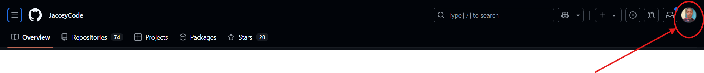
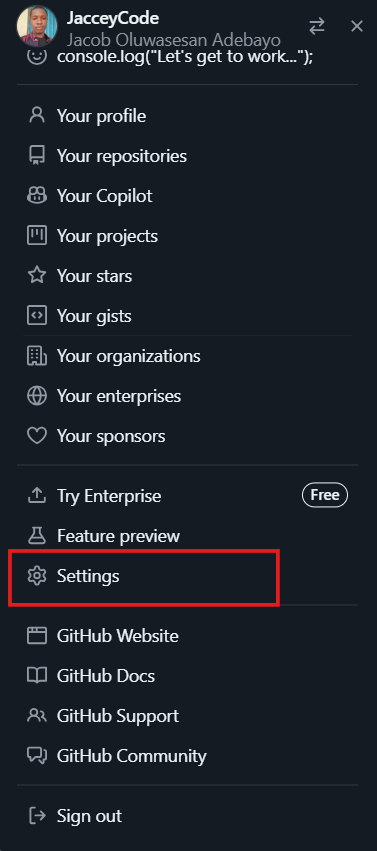
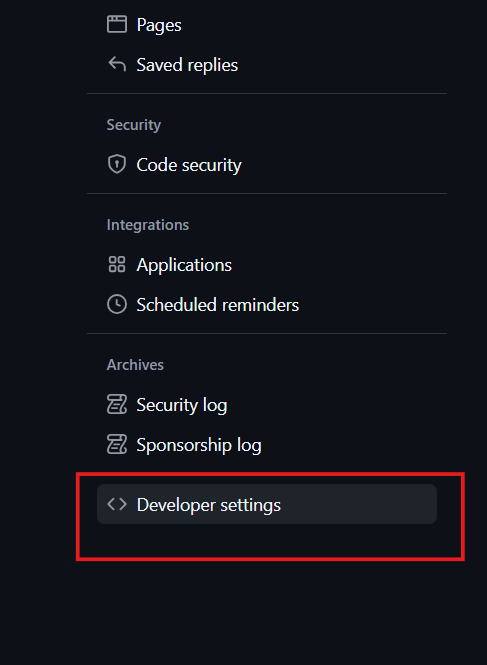
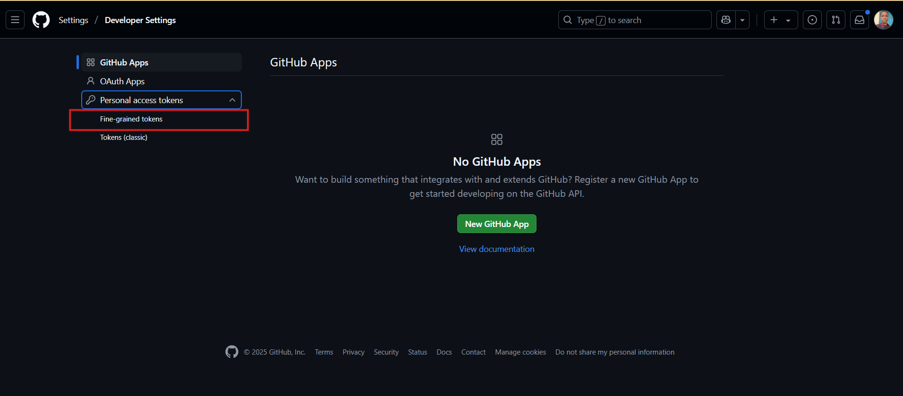
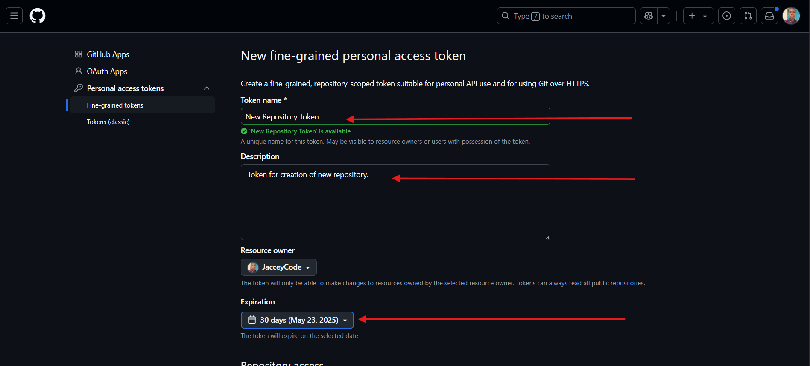
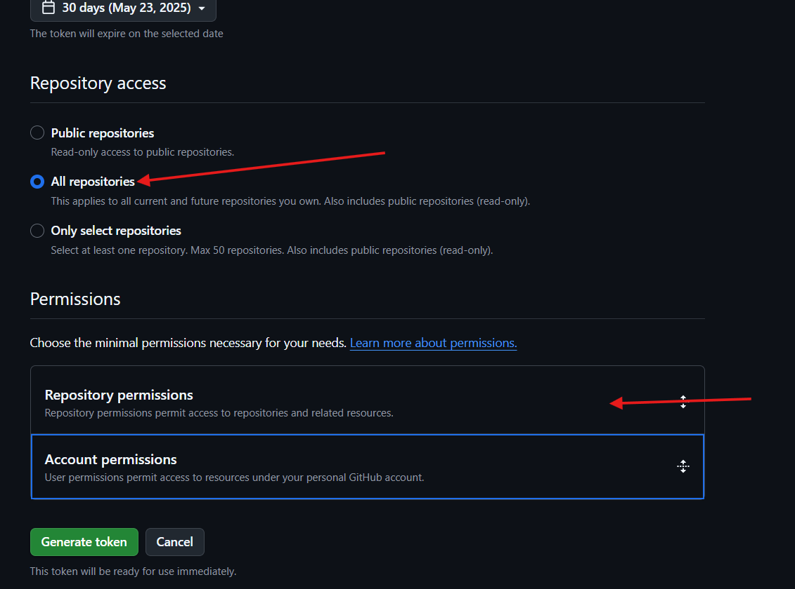
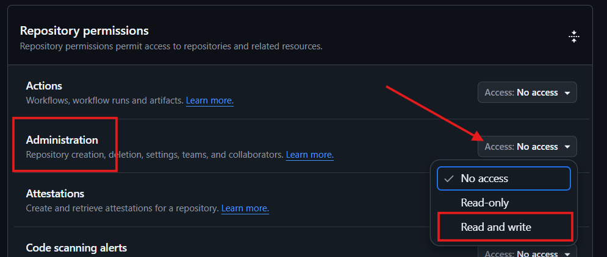
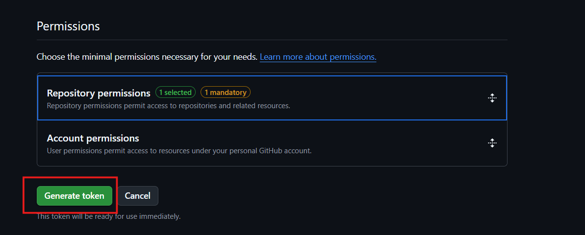
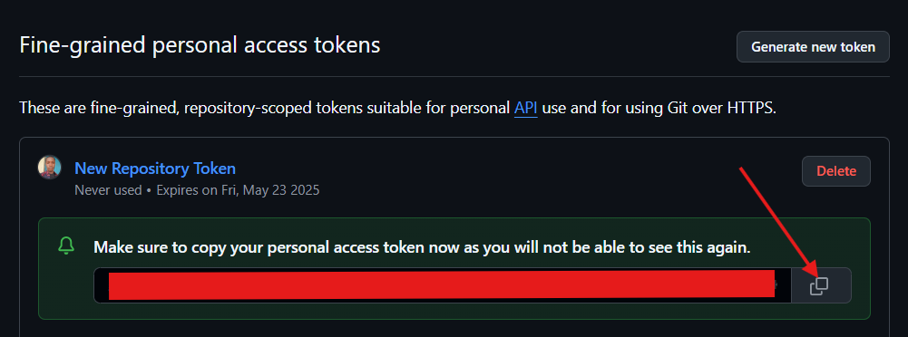

# 🚀 _GitHub Repository Creator Script_

This Bash script automates the process of creating a new GitHub repository, initializing a local Git repository, and pushing the initial commit to GitHub. It interacts with the GitHub REST API and requires a GitHub personal access token for authentication.

## 📁 What It Does

- Prompts for or accepts your GitHub credentials and repository details.
- Creates a directory with the given repository name.
- Adds a `README.md` with the repository description.
- Initializes a local Git repository.
- Creates a remote repository on the GitHub profile provided.
- Sets up the `main` branch and pushes your initial commit.

## 📦 Prerequisites

Make sure the following tools are installed on your system:

- **Git** – for version control and pushing code.
- **`jq`** – for parsing JSON returned from GitHub's API.
- **Curl** – for making API requests (usually pre-installed on Unix systems).

### Installing `jq`:

- **macOS**:

  ```bash
  brew install jq
  ```

- **Ubuntu/Debian**:

  ```bash
  sudo apt install jq
  ```

- **Windows**:
  > Download from [jq's official site](https://stedolan.github.io/jq/download/)

## 📥 Cloning This Script Repository

To use this script on your local machine, you can clone the repository:

```bash
git clone https://github.com/JacceyCode/createRepositoryScript.git
cd createRepositoryScript
chmod +x createRepository.sh
```

This will create a copy of this repository directory on your local machine, make the script executable and ready to use. Preferrably, you can move the script file from it's directory unto your desktop or project directory.

## 📜 Script Usage

### 📌 Usage from Terminal

Open your terminal and navigate into the directory where the script is located.

```bash
./createRepository.sh <githubUsername> <repoName> <description> <visibility> <githubToken>
```

### Parameters

| Argument         | Description                                                                                                                                                                                 |
| ---------------- | ------------------------------------------------------------------------------------------------------------------------------------------------------------------------------------------- |
| `githubUsername` | Your GitHub username                                                                                                                                                                        |
| `repoName`       | The desired name of the repository                                                                                                                                                          |
| `description`    | A short description of your repository                                                                                                                                                      |
| `visibility`     | Either `y/yes` (public) or `n/no` (private)                                                                                                                                                 |
| `githubToken`    | A GitHub [personal access token](https://github.com/settings/tokens) with `repo` permissions. Steps for creating _`githubToken`_ is explained in the last section of this `README.md` file. |

> **Note**: If you skip any parameters, the script will prompt you to input them interactively.

### 🔐 Example (Interactive mode)

If you run the script without any arguments:

```bash
./createRepository.sh
```

You will be prompted to enter:

- GitHub Username
- Repository Name
- Repository Description
- Visibility (`Y` for public, `N` for private)
- GitHub Token (Input is hidden for security reasons, input your token and press `Enter`)

## 📂 Output

After successful execution, the script will:

- Create a new directory named after the repository.
- Add a `README.md` file with your description.
- Push the initialized project to your GitHub account.
- Display the created repository’s URL.

## ⚠️ Notes & Tips

- Ensure your GitHub token has appropriate permissions (`repo` scope at minimum).
- The script uses `main` as the default branch.
- If an error occurs during repository creation, the error message from GitHub will be shown.
- The script securely handles your token using `read -s` (input hidden).

## ✅ Example Output

```
Creating my-awesome-project repository...
GitHub repository created at: https://github.com/yourusername/my-awesome-project
Operation completed ✅✅✅
```

## 🧼 Clean-Up

- Automatically deletes the temporary `response.json` file used to parse the GitHub API response.

## 🔐 Creating Github _`Personal Access Token`_ Steps

- On your github profile page, click on the `image_avatar_icon` on the top-right corner.

  

- On the opened sidebar, scroll down and click on `settings`.

  

- On the settings page, scroll down and click on `Developer settings` by the left.

  

- On the developer settings page, click on `Personal access tokens` and the `Fine-grained tokens`.

  

- Click on `Generate new token` button.

- On the token page, enter the `Token name`, `Description`, choose `Expiration` period.

  

- Under Repository access, select `All repositories`.

  

- Under Permissions, click on `Repository permissions` and in the dropdown, find `Administration` and click on the dropdown button by the right to change permission to `Read and write`.

  

- Scroll down and click the `Generate token` button, a modal will display, click on the `Generate token` button again.

  

- Now, your access token is available, you can copy and use.

  > Ensure your token is not openly displayed anywhere for security reasons. If it is, you can delete it and create a new one.

  

## 🧑‍💻 Author

This script is created by me, [Jacob Adebayo](https://github.com/JacceyCode). Feel free to contribute or modify!
